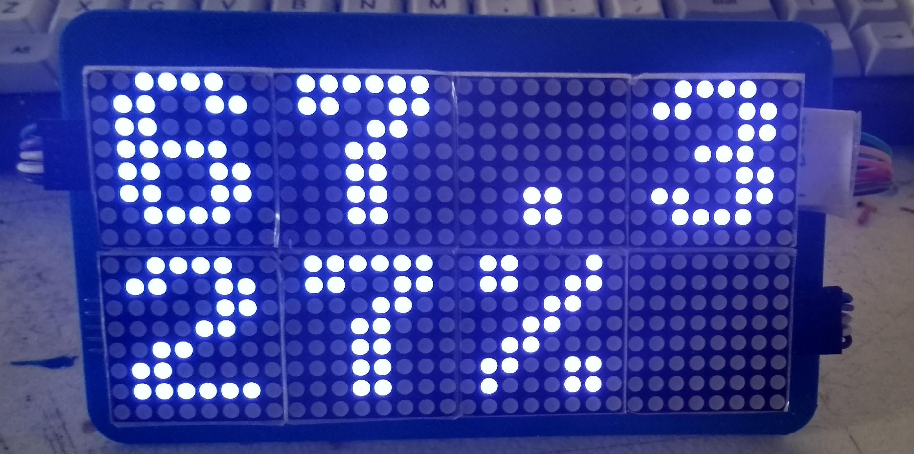
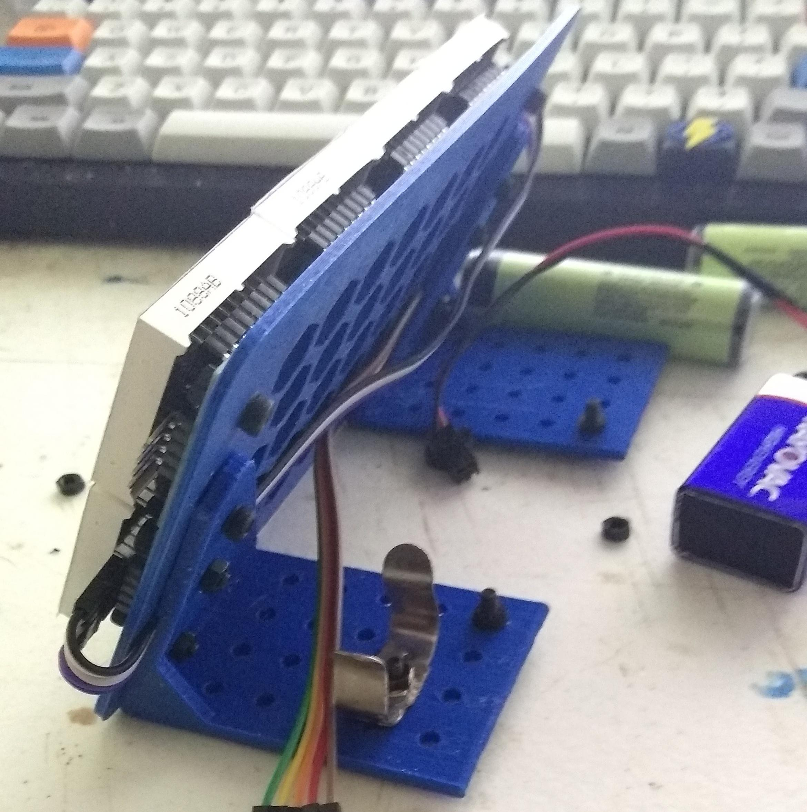

A quick and dirty micropython project, my first time playing with [these](https://www.amazon.com/gp/product/B088LQMVRQ) MAX7219 LED Matrix displays.

---

[MicroPython](http://docs.micropython.org/en/latest/esp8266/tutorial/intro.html#intro) on a low-cost ESP8266 is a great way to get started with "iot" sorts of projects.  Copy the latest firmware over, log into your wifi, set up the ["WebREPL"](http://docs.micropython.org/en/latest/esp8266/quickref.html#webrepl-web-browser-interactive-prompt) and voila, you are set to copy and update your programs wirelessly.  

---

Project `Si7021_8266` sits in my back room reading sensor data from a Si7021 sensor (see below) every 10 minutes and pushes it to an http [Azure Function](https://azure.microsoft.com/en-us/services/functions/), which is free up to 1 million triggers per month.  Also displays the info with a [Tiny OLED screen](https://www.amazon.com/gp/product/B07D9H83R4/) for 20 seconds each reading, and has a reset button to provide an immediate reading.

In turn, the `Functions` project logs the readings and conditionally triggers IFTTT to turn a smartplug on/off based on temperature trends.  (trivia(?): loads of "smart" devices run on esp chips.)

Project `Max7219_8266` downloads & displays the latest data to the [LED matrix](https://www.amazon.com/gp/product/B088LQMVRQ) from the `Functions` project every 10 minutes.  

[Deep_sleep](http://docs.micropython.org/en/latest/esp8266/tutorial/powerctrl.html?highlight=deep%20sleep#deep-sleep-mode) is great for extending battery life which is essential for the `Max7219` project.  It sleep uses just 20 microamps - just 2% of the power of "light sleep".  Downsides being that the modem is disconnected, state is not retained, a pub/sub setup would require extra work, etc.  Fortunately, i don't need the info to be live so i'm using Azure Functions http triggers to log and retrieve readings, stored as `json` on Azure blob storage, using [I/O Bindings](https://docs.microsoft.com/en-us/azure/azure-functions/functions-bindings-storage-blob-input?tabs=csharp#example).  Maintaining a log of 100 readings will run me about 0.00002¢ a month.

---

STLs for mounting the LED matrixes can be found [here](https://github.com/McNerdius/3DP/tree/master/LED%20Matrix%2016x32/STL).  The Si702 sensor station doesn't have a good enclosure yet.

Wiring diagrams to come, but the hookups for the LED matrix displays match [this](https://github.com/joewez/WifiMarquee); the Si7021 & OLED miniscreen use default i2c lines (GPIO5/4 which is D1/D2 on the [wemos d1 mini](https://www.wemos.cc/en/latest/d1/d1_mini.html)); and note you'll need to connect GPIO16 (D0 on the D1 mini) to RST for deep sleep to work.  (But put a jumper in between as you may need to disconnect it later for upgrading firmware or fixing of "soft bricks".)

I've added battery level monitoring to the `Si7021_8266` project, using the ADC. A "raw" ESP8266 expects a maximum of 1 volt on analog in, but the D1 mini has a voltage divider upping the range to 3.2v.  To drop the full battery charge of ~4.2v to the expected 3.2v, i added another voltage divider - 10k on "R1", 33k on "R2", and vOut connected to analog in (A0).  [See here](https://ohmslawcalculator.com/voltage-divider-calculator).

---

other hardware in use:

Display:

* [WeMos D1 Mini (clone)](https://www.amazon.com/gp/product/B08FQYZX37).  Both the brains and the least expensive part, i love these things.  Quite versatile and inexpensive.  No need for more expensive, higher-spec options when getting started in this realm.
* [Adafruit PowerBoost 1000 Charger](https://www.adafruit.com/product/2465).  I imagine the matrix displays are fairly power-hungry and i had one of these on hand.
  
Sensor unit:

* [Si7021](https://www.adafruit.com/product/3251) humidity/sensor unit.  Not the newer "STEMMA QT" form factor, but otherwise the same hardware.  Used this to feed data to the `Max7219` display unit project.
* [Tiny OLED screen](https://www.amazon.com/gp/product/B07D9H83R4/).  Used as a glorified "Status LED", displaying the status and info, because why not.

---

libraries in use:

* [jgbrown32's ESP8266_MAX7219](https://github.com/jgbrown32/ESP8266_MAX7219) library for the led matrix itself.
* [chrisbalmer's micropython-si7021](https://github.com/chrisbalmer/micropython-si7021) library for the humidity/sensor unit.
* [ssd1306](https://github.com/micropython/micropython/blob/master/drivers/display/ssd1306.py) for the tiny OLED display.
* `httpclient.py` - can't remember/trace down where i picked this one up.

---

