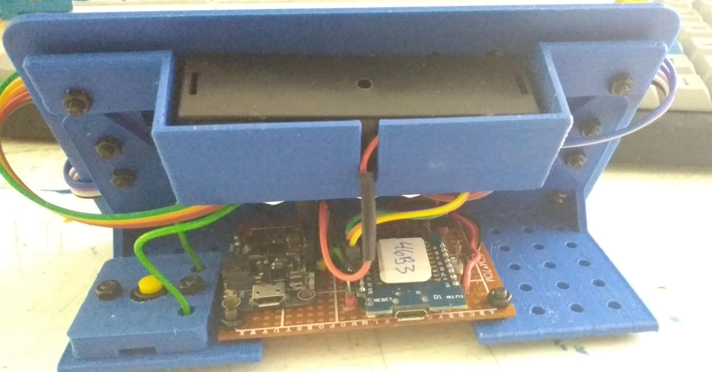

## Intro:

A quick and dirty micropython project, my first time playing with [these](https://www.amazon.com/gp/product/B088LQMVRQ) MAX7219 LED Matrix displays.

[MicroPython](http://docs.micropython.org/en/latest/esp8266/tutorial/intro.html#intro) on a low-cost ESP8266 is a great way to get started with "iot" sorts of projects. 

* Install Python
* Download the [firmware](https://micropython.org/download/esp8266)
* [Deploy](http://docs.micropython.org/en/latest/esp8266/tutorial/intro.html#deploying-the-firmware) the firmware.

Now you can [connect to the device](http://docs.micropython.org/en/latest/esp8266/tutorial/repl.html#repl-over-the-serial-port) using putty or equivalent, and install the ["WebREPL"](http://docs.micropython.org/en/latest/esp8266/quickref.html#webrepl-web-browser-interactive-prompt) where you can do normal [REPL](https://en.wikipedia.org/wiki/Read%E2%80%93eval%E2%80%93print_loop) things as well as upload files, without needing to be connected via USB.  See [here](https://gist.github.com/McNerdius/bd4138df5563b569ea4854a7bf8c5b4d#file-gistfile1-txt-L24) for my setup notes on this - lines 18-22 will get your wifi set up and enable the WebREPL.  You'll need to know the device's IP to use it of course, which will show up as "ESP_######" on your network. - line 24 shows how to get the device ID to fill in those "######" - it's also shown after flashing the firmware.  I like to write the last four digits on a [label](https://www.amazon.com/Avery-Removable-Labels-Rectangular-Inches/dp/B004INKGYA) and stick it directly on the chip for reference - helps a ton if you have more than one ESP device on your network.  (Chances are if you have any commercial "smart" devices in your home, you may already have "ESP_######" showing on your network.  Like, all of my smart plugs.)

* Toss some code into a `main.py`, send it over with the WebREPL, and hit your device's reset button or unplug/plug the USB.  Maybe something like...

```
    from machine import Pin
    p5 = Pin(5, Pin.OUT)
    p5.on()
```

  See [here](http://docs.micropython.org/en/latest/esp8266/general.html#boot-process) for more about `main.py`.

---

## The Projects:

### `Si7021_8266` 

* This sits in my back room reading sensor data from a Si7021 sensor (see below) every 10 minutes and pushes it to an http [Azure Function](https://azure.microsoft.com/en-us/services/functions/), which is free up to 1 million triggers per month.  Also displays the info with a [Tiny OLED screen](https://www.amazon.com/gp/product/B07D9H83R4/) for 20 seconds each reading, and has a reset button to provide an immediate reading.


### `Functions` 

* Logs the readings and conditionally triggers IFTTT to turn a smartplug on/off based on temperature trends.

### `Max7219_8266`

* Downloads & displays the latest data to the [LED matrix](https://www.amazon.com/gp/product/B088LQMVRQ) from the `Functions` project every 10 minutes.  

---

## The Hardware:

### `Max7219_8266` project:

* [WeMos D1 Mini (clone)](https://www.amazon.com/gp/product/B08FQYZX37).  Both the brains and the least expensive part, i love these things.  Quite versatile and inexpensive.  No need for more expensive, higher-spec options when getting started in this realm.
* [Adafruit PowerBoost 1000 Charger](https://www.adafruit.com/product/2465).  I imagine the matrix displays are fairly power-hungry and i had one of these on hand.
  
### `Si7021_8266` project:

* [Si7021](https://www.adafruit.com/product/3251) humidity/sensor unit.  Not the newer "STEMMA QT" form factor, but otherwise the same hardware.  Used this to feed data to `Max7219_8266` display unit project.
* [Tiny OLED screen](https://www.amazon.com/gp/product/B07D9H83R4/).  Used as a glorified "Status LED", displaying the status and info, because why not.

---

## Libraries In Use:

* [jgbrown32's ESP8266_MAX7219](https://github.com/jgbrown32/ESP8266_MAX7219) library for the led matrix itself.
* [chrisbalmer's micropython-si7021](https://github.com/chrisbalmer/micropython-si7021) library for the humidity/sensor unit.
* [ssd1306](https://github.com/micropython/micropython/blob/master/drivers/display/ssd1306.py) for the tiny OLED display.
* `httpclient.py` - can't remember/trace down where i picked this one up.

---

## Notes:

### Hooking it all up:

Wiring diagrams for the sensor project to come, see below for the LED Matrix. The hookups for the LED matrix displays match [this](https://github.com/joewez/WifiMarquee); the Si7021 & OLED miniscreen use default i2c lines (GPIO5/4 which is D1/D2 on the [wemos d1 mini](https://www.wemos.cc/en/latest/d1/d1_mini.html)); and note you'll need to connect GPIO16 (D0 on the D1 mini) to RST for deep sleep to work.  (But put a jumper in between as you may need to disconnect it later for upgrading firmware or fixing of "soft bricks".)  After some trial and error, i settled on a 10 ohm current limiting resistor for the LED matrix display - any higher and there was visible flickering.

I've added battery level monitoring to both projects. A "raw" ESP8266 expects a maximum of 1 volt on analog in, but the D1 mini has a voltage divider upping the range to 3.2v.  To drop the full battery charge of ~4.2v to the expected 3.2v, i added another voltage divider - 10k on "R1", 33k on "R2", and vOut connected to analog in (A0).  [See here](https://ohmslawcalculator.com/voltage-divider-calculator).  (Higher values like 15k / 51k or that keep the same ratio would work as well up to a point, and save a bit of battery life.)

---

### Battery Life:

The displayed battery levels aren't exact.  Inexact resistor values & the resulting voltage divider ratio, along with the simple linear calculation are to blame.  Just now `Max7219_8266` project was displaying 3.59v for itself and 3.88v for the `Si7021_8266` project whereas my Nitecore D4 Digicharger reported 3.65v and 3.75v respectively.  This translated to 4 out of 8 "bars" for `Max7219_8266` - where 0 is 3 volts and 8 is 4.2v - so spot on.  For `Si7021_8266`, 6 bars were reported, where 5 bars would be more accurate.

As-is, i'd expect the battery life of the `Max7219_8266` LED Matrix project to be somewhere around 36 hours total.  I'll be upgrading it to a 2 or 3 cell pack and add details later.  The `Si7021_8266` on the other hand, should be good for 2-3 weeks.
  
[Deep_sleep](http://docs.micropython.org/en/latest/esp8266/tutorial/powerctrl.html?highlight=deep%20sleep#deep-sleep-mode) is great for extending battery life which is essential for the `Max7219` project.  It uses just 20 microamps - just 2% of the power of "light sleep".  Downsides being that the modem is disconnected, state is not retained, a pub/sub setup (MQTT et al) would require extra work, etc.  Fortunately, i don't need the info to be live so i'm using Azure Functions http triggers to log and retrieve readings, stored as `json` on Azure blob storage, using [I/O Bindings](https://docs.microsoft.com/en-us/azure/azure-functions/functions-bindings-storage-blob-input?tabs=csharp#example).
 
 ---

### 3D Print for `Max7219_8266`:
  
STLs for mounting the LED matrixes can be found [here](https://github.com/McNerdius/3DP/tree/master/LED%20Matrix%2016x32/STL).  The Si702 sensor project doesn't have a good enclosure yet.

---

## What's next:

In the spirit of a quick-and-dirty getting-started, i've only mentioned WebREPL.  This is built in to MicroPython and no installs are required or assumptions are made about your development environment.  Plus, it doesn't require a USB connection.  If your project is battery-powered, or over there on the shelf, or in an enclosure with an inaccessible usb port (oops) - you're good to go.  It may be a bit clunky but i recommend getting comfy with it to start, it is the most [KISS](https://en.wikipedia.org/wiki/KISS_principle) option, even if not the most productive.  

Some tips:
  * If "connect" isn't responding, refresh the page.
  * If you still can't connect, the IP may have changed.  See intro for ideas on how to spot the new IP.
  * If your project is behaving unexpectedly and you're not in a REPL (serial or Web) you can always connect to a REPL and hit `import main` and see if it is throwing any errors.


### But wait, there's more !  

* [Micropy Cli](https://micropy-cli.readthedocs.io/en/latest/) is a great tool to add things like linting/intellisense support, project templates, and so on.

* [PyMakr](https://marketplace.visualstudio.com/items?itemName=pycom.Pymakr) is a VS Code extension that gives you a REPL, file syncing, and other conveniences.  Definitely less clunky than WebREPL but again i recommend sticking with WebREPL for a bit.  Similar to ["less code means less bugs" ](https://blog.codinghorror.com/code-smaller), having less "moving parts" to start out with will make it easier to pin down what, where, and why something is going wrong.  With WebREPL, YOU are responsible for what does and doesn't happen - when you're comfortable with that, it may become a bottleneck and you'll know what you do and don't want automated.  Also, the extension is not without its quirks (in my experience), which doesn't help when getting started.

[This](https://lemariva.com/blog/2019/08/micropython-vsc-ide-intellisense) and [This](https://lemariva.com/blog/2018/12/micropython-visual-studio-code-as-ide) are decent intros to MicroPy CLI and PyMakr.

[CircuitPython](https://learn.adafruit.com/welcome-to-circuitpython) is a fork of MicroPyhthon.  They've dropped ESP8266 support.  I'm sure there's legitimate reason they're not contributing to MicroPython directly but it seems mostly for branding.  MicroPython has been around longer, Adafruit's libraries often work without modification or are ported by the community.  My opinion: while it may be better in some ways... "This just smells bad, and I'm not going to eat it."

***Have Fun !***

---




